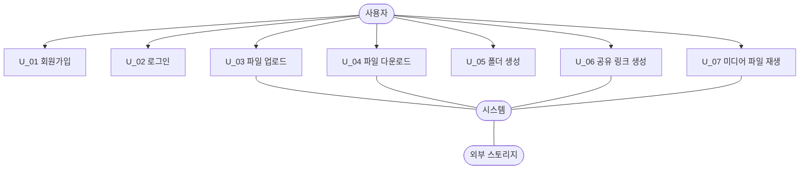

# Mini Drive (미니 드라이브) 요구사항 분석서

문서번호 : [개인명]요구사항분석서_260518_Doc-001

| 항목 | 내용 |
|------|------|
| 소 속 | 한국항공대학교 소프트웨어학과 |
| 팀 명 | |
| 팀 원 | 김병진 (2022125008) |
| 교 수 | |

---

## 제/개정 이력

| 버전 | 날짜 | 작성자 성명 | 제/개정사항 | 비고 |
|------|------|------------|------------|------|
| 1.0  | 2026-05-18 | 김병진 | 요구사항 분석서 재구성 및 보완 | |

---

## 목 차

1. 서론
   - 1.1 목적 및 범위
   - 1.2 용어 정의
   - 1.3 참조 문서
2. 시스템 개요
   - 2.1 소프트웨어 컨텍스트(Context)
   - 2.2 기능 분류 및 설명
3. 요구사항 명세
   - 3.1 정적 분석
   - 3.2 CRC 카드
   - 3.3 동적 분석
4. 인터페이스 분석
5. 제약사항
6. 요구사항 추적표
7. 참고문헌 및 부록

---

## 1. 서론

### 1.1 목적 및 범위

이 문서는 개인용 파일 저장 및 관리 시스템 **Mini Drive**의 요구사항을 정의하기 위한 문서이다. 본 시스템은 사용자가 파일과 폴더를 안전하게 저장하고, 업로드/다운로드/검색/공유/버전 관리 기능을 활용하여 개인 데이터를 효율적으로 관리할 수 있도록 지원한다. 또한 객체지향 설계 원칙을 반영하여 계층화된 구조로 시스템을 구성하는 것을 목표로 한다.

### 1.2 용어 정의

| 용어 | 설명 |
|------|------|
| DriveItem | 파일과 폴더의 공통 속성을 추상화한 상위 클래스 |
| Metadata | 파일의 이름, 크기, 수정일 등 파일을 설명하는 정보 |
| API | 응용 프로그램 기능을 제어할 수 있도록 제공되는 인터페이스 |
| 버전 관리 | 파일의 변경 이력을 기록하고 이전 상태로 복원하는 기능 |
| 공유 링크 | 특정 파일을 외부 또는 내부 사용자에게 공유하기 위한 URL |
| 계층화 | UI, 비즈니스 로직, 데이터 관리 계층을 분리하는 구조 |

### 1.3 참조 문서

- ch11 객체지향 설계 강의 자료
- [샘플] 요구사항 분석서 (open CCTV)
- Mini Drive 기존 요구사항 분석서 초안

---

## 2. 시스템 개요

### 2.1 소프트웨어 컨텍스트(Context)

본 시스템은 사용자 요청을 처리하는 애플리케이션 서버와, 파일 메타데이터를 저장하는 DB, 실제 파일이 저장되는 외부 스토리지로 구성된다.

#### 2.1.1 Actor Table

| Actor | Role |
|-------|------|
| 사용자 | 회원가입, 로그인, 파일 업로드/다운로드, 검색, 공유, 미디어 재생을 수행하는 주체 |
| 시스템 | 파일 저장, 메타데이터 처리, 공유 링크 생성, 오류 처리 등을 수행하는 주체 |
| 외부 스토리지 | 실제 파일 데이터를 물리적으로 저장하는 저장소 |

#### 2.1.2 UseCase Diagram

유스케이스 다이어그램은 다음 요소로 구성한다.
- 중앙에 **사용자** Actor 배치
- 사용자와 연결되는 Use Case:
  - U_01 회원가입
  - U_02 로그인
  - U_03 파일 업로드
  - U_04 파일 다운로드
  - U_05 폴더 생성
  - U_06 공유 링크 생성
  - U_07 미디어 파일 재생
- 각 기능 수행 시 **시스템**이 중간 처리 주체로 연결됨
- 파일 저장 및 조회 시 **외부 스토리지**가 연결됨

Mermaid 구성 예시:

### 2.2 기능 분류 및 설명

본 시스템의 주요 기능은 다음과 같다.
- 회원가입
- 로그인
- 파일 업로드
- 파일 다운로드
- 폴더 생성
- 공유 링크 생성
- 미디어 파일 재생

#### 2.2.1 UseCase Description

---

**Use Case Name : 회원가입을 한다.**
| 항목 | 내용 |
|------|------|
| ID | U_01 |
| Importance Level | High |
| Primary Actor | 사용자 |
| Use Case Type | Detail, essential |

**Brief Description :** 이 Use-Case는 사용자가 시스템에 신규 계정을 생성하는 기능을 표현한다.

**Stakeholders and Interests**
- 사용자 : 시스템에 가입하여 파일 저장 기능을 사용하길 원한다.
- 시스템 관리자 : 중복 없는 계정 정보를 안전하게 저장하길 원한다.

**Trigger :** 사용자는 회원가입 버튼을 누른다.

**Relationships**
- Association : 사용자
- Include :
- Extend :
- Generalization :

**Normal Flow of Events :**
1. 사용자는 아이디, 비밀번호, 이메일 주소를 입력한다.
2. 사용자는 회원가입하기 버튼을 누른다.
3. 시스템은 입력값의 유효성을 검사한다.
4. 시스템은 사용자 정보를 DB에 저장한다.
5. 시스템은 회원가입 성공 메시지를 출력한다.

**Alternate / Exceptional Flows :**
- 2.a1 : 공란이 있을 경우 시스템은 입력 누락 메시지를 출력한다.
- 3.a1 : 아이디가 중복된 경우 시스템은 중복 아이디 오류를 출력한다.
- 3.a2 : 이메일 형식이 올바르지 않은 경우 시스템은 형식 오류 메시지를 출력한다.

---

**Use Case Name : 로그인을 한다.**
| 항목 | 내용 |
|------|------|
| ID | U_02 |
| Importance Level | High |
| Primary Actor | 사용자 |
| Use Case Type | Detail, essential |

**Brief Description :** 이 Use-Case는 사용자가 등록된 계정으로 시스템에 로그인하는 기능을 표현한다.

**Stakeholders and Interests**
- 사용자 : 계정에 안전하게 접근하길 원한다.
- 시스템 : 올바른 인증 정보를 가진 사용자만 허용하길 원한다.

**Trigger :** 사용자는 로그인 버튼을 누른다.

**Relationships**
- Association : 사용자
- Include :
- Extend :
- Generalization :

**Normal Flow of Events :**
1. 사용자는 아이디와 비밀번호를 입력한다.
2. 사용자는 로그인하기 버튼을 누른다.
3. 시스템은 입력값을 검증한다.
4. 시스템은 계정 정보를 확인한다.
5. 시스템은 로그인 성공 시 메인 화면으로 이동시킨다.

**Alternate / Exceptional Flows :**
- 2.a1 : 아이디 또는 비밀번호가 공란이면 시스템은 입력 오류 메시지를 출력한다.
- 4.a1 : 존재하지 않는 아이디이면 시스템은 계정 없음 메시지를 출력한다.
- 4.a2 : 비밀번호가 일치하지 않으면 시스템은 비밀번호 불일치 메시지를 출력한다.
- 4.a3 : 로그인 실패 횟수가 일정 횟수 이상이면 시스템은 계정 잠금 메시지를 출력한다.

---

**Use Case Name : 파일을 업로드한다.**
| 항목 | 내용 |
|------|------|
| ID | U_03 |
| Importance Level | High |
| Primary Actor | 사용자 |
| Use Case Type | Detail, essential |

**Brief Description :** 이 Use-Case는 사용자가 파일을 시스템에 업로드하는 기능을 표현한다.

**Stakeholders and Interests**
- 사용자 : 자신의 파일을 안전하게 저장하길 원한다.
- 시스템 : 파일 메타데이터와 실제 데이터를 일관되게 관리하길 원한다.

**Trigger :** 사용자는 업로드 버튼을 누른다.

**Relationships**
- Association : 사용자
- Include : 파일 메타데이터를 저장한다.
- Extend :
- Generalization :

**Normal Flow of Events :**
1. 사용자는 업로드할 파일을 선택한다.
2. 사용자는 업로드 버튼을 누른다.
3. 시스템은 파일 크기와 형식을 검사한다.
4. 시스템은 파일을 외부 스토리지에 저장한다.
5. 시스템은 메타데이터를 DB에 저장한다.
6. 시스템은 업로드 완료 메시지를 출력한다.

**Alternate / Exceptional Flows :**
- 3.a1 : 파일 크기가 제한을 초과하면 시스템은 업로드 실패 메시지를 출력한다.
- 4.a1 : 네트워크 오류가 발생하면 시스템은 재시도 메시지를 출력한다.
- 5.a1 : 저장 공간이 부족하면 시스템은 저장 실패 메시지를 출력한다.

---

**Use Case Name : 파일을 다운로드한다.**
| 항목 | 내용 |
|------|------|
| ID | U_04 |
| Importance Level | High |
| Primary Actor | 사용자 |
| Use Case Type | Detail, essential |

**Brief Description :** 이 Use-Case는 사용자가 저장된 파일을 내려받는 기능을 표현한다.

**Stakeholders and Interests**
- 사용자 : 필요한 파일을 빠르게 다운로드하길 원한다.
- 시스템 : 권한이 있는 사용자에게만 파일을 제공하길 원한다.

**Trigger :** 사용자는 다운로드 버튼을 누른다.

**Relationships**
- Association : 사용자
- Include :
- Extend :
- Generalization :

**Normal Flow of Events :**
1. 사용자는 다운로드할 파일을 선택한다.
2. 사용자는 다운로드 버튼을 누른다.
3. 시스템은 접근 권한을 확인한다.
4. 시스템은 파일을 사용자에게 전송한다.
5. 시스템은 다운로드 완료 메시지를 출력한다.

**Alternate / Exceptional Flows :**
- 3.a1 : 권한이 없으면 시스템은 접근 거부 메시지를 출력한다.
- 4.a1 : 파일이 삭제되었으면 시스템은 파일 없음 메시지를 출력한다.

---

**Use Case Name : 폴더를 생성한다.**
| 항목 | 내용 |
|------|------|
| ID | U_05 |
| Importance Level | Mid |
| Primary Actor | 사용자 |
| Use Case Type | Detail, essential |

**Brief Description :** 이 Use-Case는 사용자가 폴더를 새로 생성하는 기능을 표현한다.

**Stakeholders and Interests**
- 사용자 : 파일을 체계적으로 분류할 수 있길 원한다.
- 시스템 : 폴더 구조를 계층적으로 유지하길 원한다.

**Trigger :** 사용자는 폴더 생성 버튼을 누른다.

**Relationships**
- Association : 사용자
- Include :
- Extend :
- Generalization :

**Normal Flow of Events :**
1. 사용자는 폴더명을 입력한다.
2. 사용자는 생성 버튼을 누른다.
3. 시스템은 폴더명 중복 여부를 검사한다.
4. 시스템은 새 폴더를 생성한다.
5. 시스템은 생성 완료 메시지를 출력한다.

**Alternate / Exceptional Flows :**
- 1.a1 : 폴더명이 공란이면 시스템은 입력 오류 메시지를 출력한다.
- 3.a1 : 동일한 폴더명이 존재하면 시스템은 중복 오류 메시지를 출력한다.

---

**Use Case Name : 공유 링크를 생성한다.**
| 항목 | 내용 |
|------|------|
| ID | U_06 |
| Importance Level | High |
| Primary Actor | 사용자 |
| Use Case Type | Detail, essential |

**Brief Description :** 이 Use-Case는 사용자가 파일을 외부 또는 내부에 공유하기 위해 링크를 생성하는 기능을 표현한다.

**Stakeholders and Interests**
- 사용자 : 특정 기간 동안만 유효한 공유 링크를 만들고 싶어 한다.
- 시스템 : 보안이 유지되는 범위 내에서 공유를 허용하길 원한다.

**Trigger :** 사용자는 공유 링크 생성 버튼을 누른다.

**Relationships**
- Association : 사용자
- Include : 링크 만료 시간을 설정한다.
- Extend :
- Generalization :

**Normal Flow of Events :**
1. 사용자는 공유할 파일을 선택한다.
2. 사용자는 공유 설정을 입력한다. (공개 범위, 만료 시간 등)
3. 사용자는 링크 생성 버튼을 누른다.
4. 시스템은 공유 링크를 생성한다.
5. 시스템은 링크 정보를 화면에 출력한다.

**Alternate / Exceptional Flows :**
- 2.a1 : 파일이 비공개 설정이면 시스템은 권한 오류를 출력한다.
- 4.a1 : 링크 생성 실패 시 시스템은 오류 메시지를 출력한다.

---

**Use Case Name : 미디어 파일을 재생한다.**
| 항목 | 내용 |
|------|------|
| ID | U_07 |
| Importance Level | Mid |
| Primary Actor | 사용자 |
| Use Case Type | Detail, essential |

**Brief Description :** 이 Use-Case는 사용자가 오디오 또는 비디오 파일을 스트리밍 방식으로 재생하는 기능을 표현한다.

**Stakeholders and Interests**
- 사용자 : 파일을 별도 다운로드 없이 바로 재생하길 원한다.
- 시스템 : 지원 형식만 안정적으로 제공하길 원한다.

**Trigger :** 사용자는 미디어 파일을 더블 클릭한다.

**Relationships**
- Association : 사용자
- Include :
- Extend :
- Generalization :

**Normal Flow of Events :**
1. 사용자는 미디어 파일을 선택한다.
2. 시스템은 파일 형식을 검사한다.
3. 시스템은 스트리밍 재생을 시작한다.
4. 시스템은 재생 제어 기능을 제공한다. (재생/일시정지/정지)

**Alternate / Exceptional Flows :**
- 2.a1 : 지원하지 않는 형식이면 시스템은 재생 불가 메시지를 출력한다.
- 3.a1 : 네트워크 상태가 불안정하면 시스템은 버퍼링 메시지를 출력한다.

---

## 3. 요구사항 명세

### 3.1 정적 분석

본 시스템은 UI, 비즈니스 로직, 데이터 저장 계층을 분리하는 구조를 가진다. 핵심 도메인 객체는 DriveItem 추상 클래스를 기반으로 파일과 폴더가 확장되며, 메타데이터와 접근 제어 정보를 함께 관리한다.

#### 3.1.1 주요 클래스 정의

- DriveItem : 파일과 폴더의 공통 속성을 정의하는 추상 클래스
- FileItem : 실제 파일 정보를 표현하는 클래스
- FolderItem : 폴더 정보를 표현하는 클래스
- User : 시스템 사용자 정보를 표현하는 클래스
- AuthService : 로그인 및 인증을 처리하는 서비스 클래스
- FileService : 파일 업로드/다운로드를 처리하는 서비스 클래스
- ShareService : 공유 링크 생성을 처리하는 서비스 클래스
- StorageRepository : 외부 스토리지와 연동하는 저장소 클래스
- MetadataRepository : 파일 메타데이터를 저장/조회하는 클래스

#### 3.1.2 클래스 관계 요약

1. FileItem과 FolderItem은 DriveItem을 상속한다.
2. FolderItem은 여러 개의 DriveItem을 포함할 수 있다.
3. User는 FileService, AuthService, ShareService와 연관된다.
4. Service 계층은 Repository 계층에 의존한다.
5. Repository 계층은 외부 스토리지와 DB를 직접 다룬다.

#### 3.1.3 클래스 다이어그램 구성 설명

Mermaid classDiagram으로 작성할 경우 다음과 같이 구성한다.

- 상단: DriveItem 추상 클래스
- 중간 좌측: FileItem
- 중간 우측: FolderItem
- 하단 좌측: User
- 하단 우측: AuthService, FileService, ShareService
- 가장 하단: MetadataRepository, StorageRepository

관계 표현:
- `DriveItem <|-- FileItem`
- `DriveItem <|-- FolderItem`
- `FolderItem o-- DriveItem`
- `User --> AuthService`
- `User --> FileService`
- `User --> ShareService`
- `AuthService --> MetadataRepository`
- `FileService --> StorageRepository`
- `FileService --> MetadataRepository`
- `ShareService --> MetadataRepository`

### 3.2 CRC 카드

---

**Class Name: DriveItem**
| 항목 | 내용 |
|------|------|
| ID | C_01 |
| Type | Abstract, Domain |

**Description:** 파일과 폴더의 공통 속성을 갖는 추상 클래스이다.
**Associated Use Case:** U_03, U_04, U_05, U_06, U_07

| Responsibilities | Collaborators |
|-----------------|---------------|
| 이름 관리() : void | FileItem, FolderItem |
| 메타데이터 제공() : void | MetadataRepository |

**Attributes**
- 이름 : String
- 생성일 : DateTime
- 수정일 : DateTime
- 경로 : String

**Relationships**
- Generalization: FileItem, FolderItem
- Aggregation: FolderItem
- Other Associations: MetadataRepository

---

**Class Name: FileItem**
| 항목 | 내용 |
|------|------|
| ID | C_02 |
| Type | Concrete, Domain |

**Description:** 실제 파일 데이터를 표현하는 클래스이다.
**Associated Use Case:** U_03, U_04, U_06, U_07

| Responsibilities | Collaborators |
|-----------------|---------------|
| 파일 업로드() : void | FileService |
| 파일 다운로드() : void | FileService |
| 파일 형식 검사() : void | User |

**Attributes**
- 파일 크기 : Long
- 파일 형식 : String
- 소유자 아이디 : String

**Relationships**
- Generalization: DriveItem
- Aggregation: 없음
- Other Associations: FileService, MetadataRepository

---

**Class Name: FolderItem**
| 항목 | 내용 |
|------|------|
| ID | C_03 |
| Type | Concrete, Domain |

**Description:** 폴더 구조를 표현하는 클래스이다.
**Associated Use Case:** U_05

| Responsibilities | Collaborators |
|-----------------|---------------|
| 폴더 생성() : void | User |
| 하위 항목 관리() : void | DriveItem |

**Attributes**
- 폴더 이름 : String
- 상위 폴더 ID : String

**Relationships**
- Generalization: DriveItem
- Aggregation: DriveItem
- Other Associations: User

---

**Class Name: User**
| 항목 | 내용 |
|------|------|
| ID | C_04 |
| Type | Concrete, Domain |

**Description:** 시스템을 사용하는 사용자 계정 클래스이다.
**Associated Use Case:** U_01, U_02, U_03, U_04, U_05, U_06, U_07

| Responsibilities | Collaborators |
|-----------------|---------------|
| 회원가입() : void | AuthService |
| 로그인() : void | AuthService |
| 파일 업로드() : void | FileService |
| 파일 다운로드() : void | FileService |
| 공유 링크 생성() : void | ShareService |

**Attributes**
- 사용자 ID : String
- 비밀번호 : String
- 이메일 : String

**Relationships**
- Generalization: 없음
- Aggregation: FolderItem
- Other Associations: AuthService, FileService, ShareService

---

**Class Name: AuthService**
| 항목 | 내용 |
|------|------|
| ID | C_05 |
| Type | Service |

**Description:** 회원가입과 로그인 인증을 처리하는 서비스 클래스이다.
**Associated Use Case:** U_01, U_02

| Responsibilities | Collaborators |
|-----------------|---------------|
| 회원가입 처리() : void | User, MetadataRepository |
| 로그인 처리() : void | User, MetadataRepository |

**Attributes**
- 인증 상태 : Boolean

**Relationships**
- Dependency: User, MetadataRepository
- Other Associations: 없음

---

**Class Name: FileService**
| 항목 | 내용 |
|------|------|
| ID | C_06 |
| Type | Service |

**Description:** 파일 업로드와 다운로드를 처리하는 서비스 클래스이다.
**Associated Use Case:** U_03, U_04, U_07

| Responsibilities | Collaborators |
|-----------------|---------------|
| 업로드 처리() : void | FileItem, StorageRepository, MetadataRepository |
| 다운로드 처리() : void | FileItem, StorageRepository |
| 미디어 재생 요청() : void | StorageRepository |

**Attributes**
- 전송 상태 : String

**Relationships**
- Dependency: FileItem, StorageRepository, MetadataRepository

---

**Class Name: ShareService**
| 항목 | 내용 |
|------|------|
| ID | C_07 |
| Type | Service |

**Description:** 공유 링크 생성과 공유 범위 설정을 처리하는 서비스 클래스이다.
**Associated Use Case:** U_06

| Responsibilities | Collaborators |
|-----------------|---------------|
| 링크 생성() : void | User, MetadataRepository |
| 만료 시간 설정() : void | MetadataRepository |

**Attributes**
- 링크 토큰 : String
- 만료 시간 : DateTime

**Relationships**
- Dependency: User, MetadataRepository

---

**Class Name: StorageRepository**
| 항목 | 내용 |
|------|------|
| ID | C_08 |
| Type | Repository |

**Description:** 외부 스토리지에 파일을 저장하고 가져오는 클래스이다.
**Associated Use Case:** U_03, U_04, U_07

| Responsibilities | Collaborators |
|-----------------|---------------|
| 파일 저장() : void | FileService |
| 파일 조회() : void | FileService |

**Attributes**
- 저장 경로 : String

**Relationships**
- Dependency: FileService

---

**Class Name: MetadataRepository**
| 항목 | 내용 |
|------|------|
| ID | C_09 |
| Type | Repository |

**Description:** 파일 및 사용자 관련 메타데이터를 저장/조회하는 클래스이다.
**Associated Use Case:** U_01, U_02, U_03, U_04, U_05, U_06

| Responsibilities | Collaborators |
|-----------------|---------------|
| 사용자 저장() : void | AuthService |
| 파일 정보 저장() : void | FileService |
| 공유 정보 저장() : void | ShareService |

**Attributes**
- DB 연결 정보 : String

**Relationships**
- Dependency: AuthService, FileService, ShareService

### 3.3 동적 분석

동적 분석은 각 유스케이스에서 객체가 시간 순서에 따라 상호작용하는 흐름을 설명한다. 순차 다이어그램은 다음 구조로 작성한다.

공통 흐름 형식:
- Actor
- Boundary(UI)
- Controller/Service
- Repository/Storage
- Response

#### 3.3.1 회원가입을 한다.

구성:
- 사용자 → 회원가입 화면(UI) → AuthService → MetadataRepository → AuthService → UI → 사용자

#### 3.3.2 로그인을 한다.
구성:

- 사용자 → 로그인 화면(UI) → AuthService → MetadataRepository → AuthService → UI → 사용자
- 예외 흐름: 계정 없음, 비밀번호 불일치

#### 3.3.3 파일을 업로드한다.

구성:
- 사용자 → 업로드 화면(UI) → FileService → StorageRepository → MetadataRepository → FileService → UI → 사용자

#### 3.3.4 파일을 다운로드한다.

구성:
- 사용자 → 다운로드 화면(UI) → FileService → StorageRepository → FileService → UI → 사용자

#### 3.3.5 폴더를 생성한다.

구성:
- 사용자 → 폴더 생성 화면(UI) → FolderItem 또는 FolderService → MetadataRepository → UI → 사용자

#### 3.3.6 공유 링크를 생성한다.

구성:
- 사용자 → 공유 화면(UI) → ShareService → MetadataRepository → ShareService → UI → 사용자

#### 3.3.7 미디어 파일을 재생한다.

구성:
- 사용자 → 재생 UI → FileService → StorageRepository → UI → 사용자

---

## 4. 인터페이스 분석

- 웹 브라우저 기반 UI를 사용한다.
- 시스템은 RESTful API 형태로 서버와 통신한다.
- 외부 스토리지와는 파일 저장/조회 API로 연동한다.
- 공유 링크 생성 시 토큰 기반 식별자를 사용한다.

---

## 5. 제약사항

- 단일 파일 최대 업로드 크기: 2GB
- 동시 접속 사용자 수: 최대 200명
- 파일 버전 보관 수: 최소 10개
- 파일 검색 및 다운로드 응답 시간: 평균 2초 이내
- 서비스 가용성: 99.99% 이상
- 지원 브라우저: Chrome, Safari, Edge 최신 버전
- 공유 링크 만료 시간은 선택적으로 설정 가능

---

## 6. 요구사항 추적표

| 요구사항 ID | U_01 | U_02 | U_03 | U_04 | U_05 | U_06 | U_07 |
|:---:|:---:|:---:|:---:|:---:|:---:|:---:|:---:|
| FR_001 회원가입 기능 | O |  |  |  |  |  |  |
| FR_002 로그인 기능 |  | O |  |  |  |  |  |
| FR_003 파일 업로드 기능 |  |  | O |  |  |  |  |
| FR_004 파일 다운로드 기능 |  |  |  | O |  |  |  |
| FR_005 폴더 생성 기능 |  |  |  |  | O |  |  |
| FR_006 공유 링크 생성 기능 |  |  |  |  |  | O |  |
| FR_007 미디어 재생 기능 |  |  |  |  |  |  | O |

---

## 7. 참고문헌 및 부록

- ch11 객체지향 설계 강의 자료
- Mini Drive 기존 요구사항 분석서 초안
- ISO/IEC 25010 품질 모델